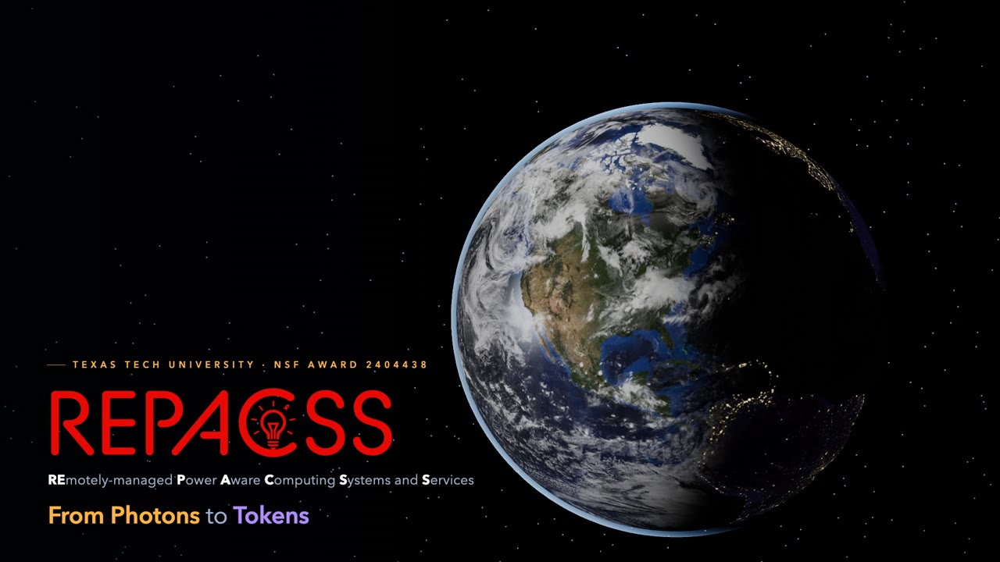

# REPACSS — From Photons to Tokens

A 7-minute narrated explainer video for **REPACSS** (REmotely-managed Power Aware Computing Systems and Services) at Texas Tech University, supported by NSF Award 2404438.

It follows energy from the sun to the GLEAMM microgrid at the Reese Technology Center, through the solar array, battery, generator and grid, into the REPACSS cluster, and out as AI tokens. It then covers the project's research challenges: power instrumentation, remote management, energy-aware scheduling, and checkpoint/restore.

[](https://github.com/Artlands/REPACSS_animation/releases/download/v1.0.0/REPACSS_photons_to_tokens.mp4)

**▶ Watch / download the video:** [REPACSS_photons_to_tokens.mp4 (release v1.0.0)](https://github.com/Artlands/REPACSS_animation/releases/download/v1.0.0/REPACSS_photons_to_tokens.mp4) — 7:00, 1080p, with captions. See all [releases](https://github.com/Artlands/REPACSS_animation/releases).

Every frame is rendered from code. The scenes are written in [three.js](https://threejs.org), headless Chrome captures them frame by frame, and ffmpeg encodes the result. The narration is synthesized speech, and the music bed is generated in code.

## Branches

Each variant lives on its own branch, built on `main`.

| Branch | What it adds |
|---|---|
| [`main`](https://github.com/Artlands/REPACSS_animation/tree/main) | *From Photons to Tokens*, the 7-minute narrated explainer |
| [`one-day-story`](https://github.com/Artlands/REPACSS_animation/tree/one-day-story) | *One Day at REPACSS*, a 3-minute story of a single summer day at the site |
| [`job-story`](https://github.com/Artlands/REPACSS_animation/tree/job-story) | *The Journey of Job 41827*, a 3-minute story of one research job. Built on `one-day-story`, so it has both stories |
| [`hand-drawn-animation`](https://github.com/Artlands/REPACSS_animation/tree/hand-drawn-animation) | The main video restyled as chalk and pastel on dark paper |

## Pipeline

```
narration.py ──► build/narration.wav, build/captions.srt, timeline.json
                        │ (sentence start times drive every animation beat)
render.mjs   ──► build/REPACSS_photons_to_tokens_nomusic.mp4
music.py     ──► build/REPACSS_photons_to_tokens.mp4   (final: video + narration + music + captions)
```

1. **`narration.py`** synthesizes the script one sentence at a time with Qwen3-TTS 1.7B (via `mlx-audio`). It clones a single reference clip so every sentence has the same voice.
   - Each take is transcribed with Whisper and pitch-checked. Takes that misread a number or drift from the reference voice are re-generated.
   - Takes are cached in `build/tts/`, so editing one sentence re-synthesizes only that sentence.
2. **`render.mjs`** serves `index.html`, steps `window.renderAt(t)` frame by frame in headless Chrome at 30 fps, and pipes the frames to ffmpeg.
3. **`music.py`** synthesizes an ambient pad-and-pluck bed. Using `timeline.json`, it ducks the music under each spoken sentence and lifts it at the intro and the end card. It then remuxes the rendered video with the new audio track, so changing the music doesn't require a re-render.

## Requirements

- **macOS on Apple Silicon** (the TTS and Whisper models run on MLX)
- **Google Chrome**, at `/Applications/Google Chrome.app` (see `render.mjs`)
- **Node.js** 20+ and **ffmpeg**
- **Python 3.12** with `mlx-audio`, `mlx-whisper`, `numpy`, `scipy`. The scripts look for this environment at `.venv-tts/`.

```bash
npm install
uv venv .venv-tts --python 3.12
uv pip install --python .venv-tts/bin/python mlx-audio mlx-whisper numpy scipy
```

The models (`mlx-community/Qwen3-TTS-12Hz-1.7B-Base-bf16`, `mlx-community/whisper-large-v3-turbo`) download from Hugging Face on first run.

## Usage

```bash
.venv-tts/bin/python narration.py      # 1. narration + timeline (only re-synthesizes changed sentences)
node render.mjs video                  # 2. full render (~10 min on an M-series Mac)
.venv-tts/bin/python music.py          # 3. mix music → build/REPACSS_photons_to_tokens.mp4
```

Previewing and checking:

```bash
node render.mjs stills 12,45.5,200     # PNG stills at those times → build/stills/
node render.mjs video 180 240          # partial preview clip → build/preview_180-240.mp4
node render.mjs zcheck                 # report coplanar overlapping faces (z-fighting) per scene
```

To scrub interactively, open `index.html` through any static server (for example `npx serve`) and add `?t=95` to show a single frame or `?play=95` to play from that time.

To tune the music, change the three numbers at the top of `music.py` (`BED_DB`, `DUCK_DB`, `SWELL_DB`), then rerun step 3.

## Project layout

| Path | Contents |
|---|---|
| `src/main.js` | Renderer, post-processing (bloom), scene switching and fades, `window.renderAt(t)` |
| `src/lib.js` | Easing, overlay UI, sprites and particle flows; solar array and rack/cabinet builders (`RACKS` holds the per-rack node layout) |
| `src/nodes.js` | Detailed server models: Dell R7625 CPU node, R760xa GPU node (4 × H100 NVL), R760xd2 storage node |
| `src/scenes/*.js` | One file per scene, in story order: `intro` → `site` → `problem` → `energy` → `photon` → `compute` → `tokens` → `measure` → `remote` → `schedule` → `checkpoint` → `outro` |
| `src/zcheck.js` | Z-fighting detector used by `render.mjs zcheck` |
| `narration.py` | The script (one entry per scene), spoken-form fixes, TTS and QA |
| `timeline.json` | Generated: scene start times, durations and sentence times |
| `assets/` | Logos, Earth textures, high-resolution Texas patch, TTS voice reference |
| `build/` | Generated outputs (git-ignored) |

Each scene builder receives its sentence start times (`sc.s(i)`), so camera moves, labels and cards stay locked to the narration. After changing the script, rerun the pipeline and the visuals follow the new timing.

## Sources and credits

- Facility, cluster, node and network details come from REPACSS project materials. GLEAMM building and site layout follow REPACSS site photos and the [repacss.org gallery](https://www.repacss.org/gallery/).
- Earth imagery: NASA Visible Earth, *Blue Marble: Next Generation* (July 2004), including a 240 px/degree crop over West Texas. City lights, clouds and ocean mask come from the three.js example textures (NASA-derived).
- Harmonic-distortion profiles and per-code energy figures in the `measure` scene are illustrative and are labeled as such on screen.

## License

Code is released under the [MIT License](LICENSE). The REPACSS, Texas Tech and NSF names and logos in `assets/` are trademarks of their owners and are not covered by this license. The Earth imagery is NASA public-domain data.
